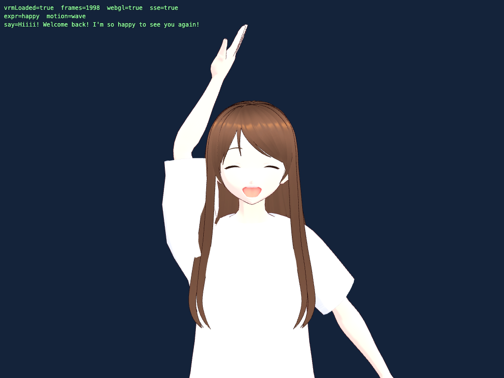
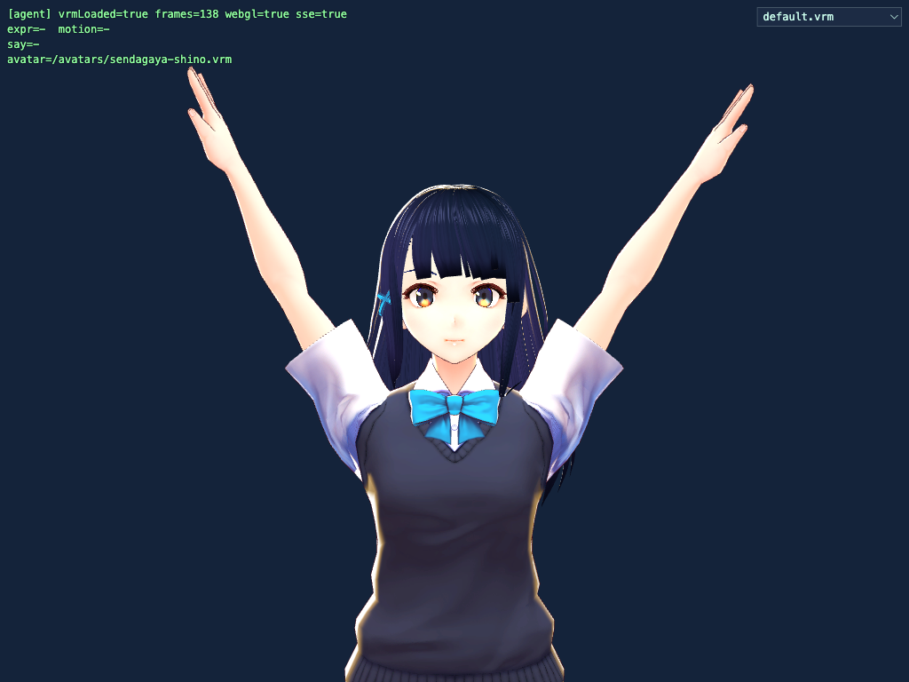
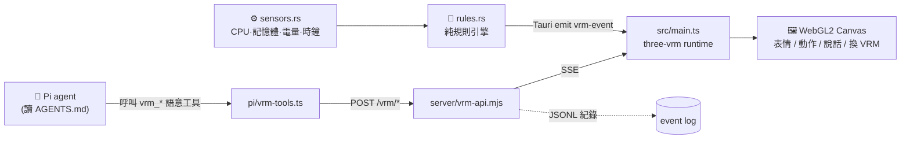
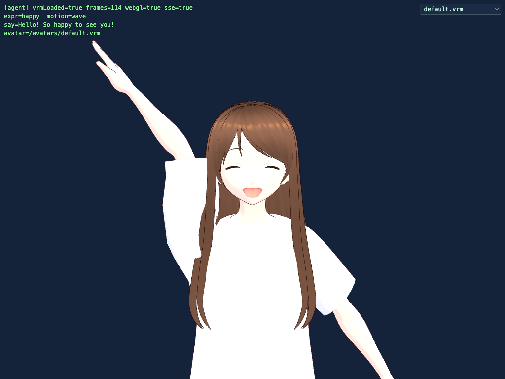

<div align="center">

# 🎭 VRM · Pi · three-vrm

**一個會「自己動」的 3D VRM 虛擬角色**

真實 `three-vrm` 瀏覽器渲染 · 可被 AI agent 以語意工具驅動 · 也能打包成偵測系統狀態自動演出的桌面寵物



<sub>由 Pi agent 讀取角色設定後,自主呼叫工具讓 Aria 露出笑容、揮手並說話 —— 全程真實 WebGL 渲染,非 mock。</sub>

</div>

---

## ✨ 這是什麼

這不是假的示意,而是**真的 three-vrm runtime**。同一份前端,支援兩種運作模式:

- 🤖 **Agent 模式** — Pi agent 讀取 `pi/AGENTS.md` 的角色設定,自己決定並呼叫高階**語意工具**(`vrm_say` / `vrm_expression` / `vrm_motion` / `vrm_reset`),透過本地 API + SSE 讓角色即時做表情、動作、說話。
- 🖥️ **獨立桌面模式** — 用 [Tauri](https://tauri.app) 打包成 macOS 桌面 app,**Rust 後端持續偵測系統狀態**(CPU / 記憶體 / 電量 / 時鐘),以**純規則引擎**自動演出。**零模型、零網路、完全自己運作。**

兩種模式都支援**執行時更換 VRM 角色**。

---

## 🌟 特色

- 🎨 **真實 WebGL2 渲染**(three.js + `@pixiv/three-vrm`)—— 有像素級驗證,不是 mock
- 🧠 **系統感知、自動演出**:高 CPU → 驚訝、低電量 → 難過、插電 → 開心揮手、整點 → 報時、閒置 → 放鬆
- 🔀 **執行時換 VRM**:下拉選單 / HTTP API / 網址參數 / Tauri 指令;同時支援 **VRM 0.x 與 1.0**
- 🗣️ **AI agent 以語意工具操控**(本地 Qwen 或 OpenRouter 皆可),只暴露 4 個語意工具,不開放 shell / 原始骨骼
- 🖥️ **一鍵打包**成 macOS `.app` 桌面寵物
- ✅ **全程可驗證**:Playwright 渲染證明 + Rust 單元測試 + 真實 agent round

---

## 📸 Demo

| 🤖 Agent 驅動 | 🔀 執行時更換 VRM |
|:---:|:---:|
|  |  |
| Pi 讀 `AGENTS.md` → 呼叫工具<br/>讓 Aria 微笑 + 揮手 + 說話 | `default.vrm`(VRM 1.0)<br/>→ `sendagaya-shino.vrm`(VRM 0.x) |

---

## 🏗️ 架構

一個前端,兩種傳輸來源 —— 所以瀏覽器測試與桌面 app 跑的是**同一份渲染程式**。



- **Agent 模式**:`Pi → vrm-tools.ts → vrm-api.mjs →(SSE)→ main.ts → three-vrm`
- **獨立模式**:`sensors.rs → rules.rs →(Tauri IPC）→ main.ts → three-vrm`

前端開機時自動判斷:在 Tauri 視窗內 → 走 Tauri IPC;在一般瀏覽器 → 連 SSE。

---

## 🚀 快速開始

```bash
cd vrm-pi-three-vrm-goal-target
npm install
```

### 🖥️ 獨立桌面寵物(系統感知、自動演出)

```bash
npm run tauri:dev      # 開發執行(需先安裝 Rust toolchain)
npm run tauri:build    # 打包成 .app / .dmg
```

打包好的 app:`src-tauri/target/release/bundle/macos/VRM Pet.app`(直接雙擊即可執行)。

### 🤖 Agent 模式(Pi / HTTP 驅動)

```bash
# 終端機 1 — VRM API + SSE 事件橋(:8970)
npm run api
# 終端機 2 — 瀏覽器 runtime(Vite)
npm run dev
# 接著用 Pi 驅動(見下方「Pi agent 語意工具」)
```

---

## 📂 專案結構

```
vrm-pi-three-vrm-goal-target/
├── index.html                  # 入口頁(canvas + HUD + 機器可讀狀態)
├── src/main.ts                 # three-vrm runtime:渲染、表情/動作/說話、loadVrm 換角色、雙傳輸、下拉選單
├── server/vrm-api.mjs          # Express:POST /vrm/{say,expression,motion,reset,load}、GET /vrm/{events,avatars,health}
├── pi/
│   ├── AGENTS.md               # 「Aria」角色設定 + 一定要用工具的規則
│   └── vrm-tools.ts            # Pi 擴充:4 個語意工具 → POST 到 API
├── src-tauri/                  # 獨立桌面 app(Rust)
│   ├── src/main.rs             # Tauri app:2 秒一次的偵測迴圈 + list_avatars / load_avatar
│   ├── src/sensors.rs          # CPU / 記憶體(sysinfo)+ 電量(pmset)+ 時鐘
│   ├── src/rules.rs            # 純規則引擎(可單元測試)
│   └── tauri.conf.json         # 視窗 / 打包設定
├── public/avatars/             # 可切換的 VRM(default.vrm、sendagaya-shino.vrm、SOURCES.md)
├── proof-{a,b,c,d}.mjs         # 驗證腳本
├── docs/                       # 設計 spec + 圖片
└── CLAUDE.md                   # 開發指南(給 Claude / 工程師)
```

---

## 🎛️ 規則引擎(獨立模式的自動演出)

定義在 `src-tauri/src/rules.rs`,只在**狀態改變 / 邊緣觸發**時發動,並有冷卻時間,所以角色不會狂刷:

| 條件 | 角色反應 |
|---|---|
| CPU > 85% | 😠 生氣 +「Phew, I'm flat out here!」|
| CPU > 70% | 😲 驚訝 |
| 記憶體 > 85% | 😢 難過 |
| 電量 < 20% 且未充電 | 😢 難過 +「My battery's getting low…」|
| 開始充電(邊緣) | 😄 開心 + 👋 揮手 +「Ah, power!」|
| 每到整點(一次) | 👋 揮手 +「It's N o'clock!」|
| 閒置(CPU < 25%) | 😌 放鬆 + 偶爾點頭 |

> 想改角色個性,只要編輯 `rules.rs` 這張表即可(改完 `cargo test` 驗證)。

---

## 🔀 更換 VRM

把任意 `.vrm` 丟進 `public/avatars/`,就會自動出現在下拉選單。執行時可用四種方式切換:

| 方式 | 用法 |
|---|---|
| 下拉選單 | 視窗右上角的 `<select>` |
| 網址參數 | `?vrm=sendagaya-shino.vrm` |
| HTTP API | `POST /vrm/load {"name":"sendagaya-shino.vrm"}` |
| Tauri 指令 | `load_avatar(name)` |

> 🧭 **朝向**:VRM 1.0 樣本朝 +Z(面向鏡頭);VRM 0.x 朝 −Z,因此 `main.ts` 會把 VRM0 旋轉 180° 以正面示人。

---

## 🗣️ Pi agent 語意工具

`pi/AGENTS.md` 把角色設定成 **Aria**,並明確要求「用工具、不要用文字描述動作」。`pi/vrm-tools.ts` 只暴露這 4 個語意工具(不開放 shell / 原始骨骼 / 任意 HTTP):

| 工具 | 功能 | 參數 |
|---|---|---|
| `vrm_expression` | 設定表情 | `emotion`: happy / angry / sad / relaxed / surprised / neutral |
| `vrm_motion` | 播放動作 | `motion`: wave / nod |
| `vrm_say` | 說一句話 | `text` |
| `vrm_reset` | 回到中性 | （無）|

執行(本地 Qwen,文字模式):

```bash
cd pi
pi -e vrm-tools.ts --no-builtin-tools \
   -t vrm_say,vrm_expression,vrm_motion,vrm_reset \
   --provider llama-server --model "HauhauCS/Qwen3.6-27B-Uncensored-HauhauCS-Balanced" \
   --thinking off -p "開心地跟我打招呼並揮手"
```

---

## ✅ 驗證(此專案是真的,不是 mock)

```bash
node proof-a.mjs                                   # 渲染:直接打 API → 真 GPU 瀏覽器 + 像素檢查 + 截圖
node proof-b.mjs                                   # 本地 Qwen agent → 工具 → event log(happy/wave/say)
bash proofs/setup-handless.sh && node proof-c.mjs  # handless-termal 驅動 agent → 瀏覽器 E2E
node proof-d.mjs                                   # 執行時換 VRM
( cd src-tauri && cargo test )                     # 規則引擎單元測試（5 項）
```

<div align="center">

<br/><sub>Proof A:真實 WebGL2 渲染,像素檢查通過(非全白 / 全黑 / 空白)。</sub>
</div>

---

## ⚙️ 模型注意事項（重要,可省下重新除錯）

- **Agent** 用**本地 Qwen 3.6 27B**(`llama-server`),在 pi **文字模式 + `--thinking off`** 下最穩(約 13 秒、可靠呼叫工具)。
- pi 的 **`--mode json`**(handless-termal 強制使用)在此本地模型上**無法在合理時間完成**,因此 handless round 改用 OpenRouter `deepseek/deepseek-v4-flash`(透過 `bin/pi` 包裝),其餘全本地。
- `llama-server` 是**單一 slot(`-np 1`)**:被中斷的 json 請求會卡住下一個請求 —— 讓它跑完,別中途 kill;`pi --no-tools -p "PONG"` 可確認 slot 空閒。

---

## 📜 VRM 資產授權

| 檔案 | 來源 | 授權 | 版本 |
|---|---|---|---|
| `default.vrm` | pixiv `three-vrm` 範例(`VRM1_Constraint_Twist_Sample`)| **MIT** | VRM 1.0 |
| `sendagaya-shino.vrm` | `madjin/vrm-samples`（VRoid）| **CC0** | VRM 0.x |

詳見 `public/avatars/SOURCES.md`。皆可安全用於本地開發。

---

## 📄 文件

- 開發指南:[`CLAUDE.md`](CLAUDE.md)
- 設計 spec:[`docs/superpowers/specs/2026-06-14-standalone-vrm-desktop-pet-design.md`](docs/superpowers/specs/2026-06-14-standalone-vrm-desktop-pet-design.md)

<div align="center"><sub>three.js · @pixiv/three-vrm · Tauri · Express · Playwright · Pi</sub></div>
