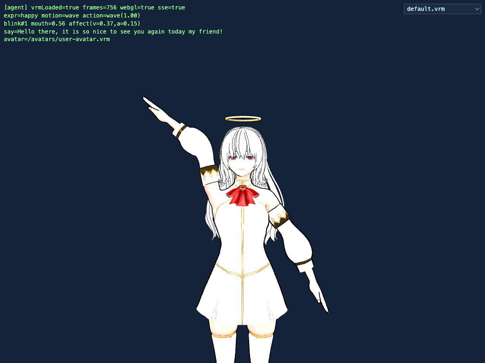
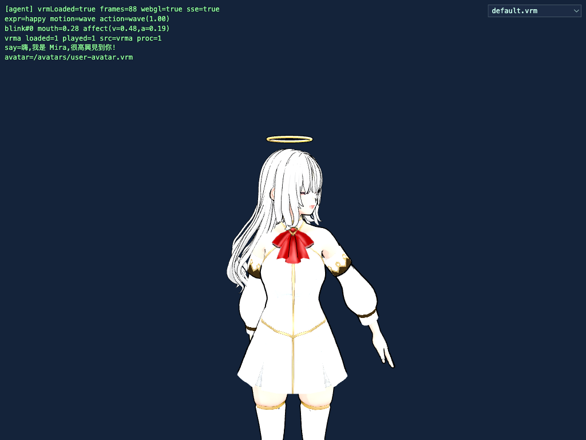
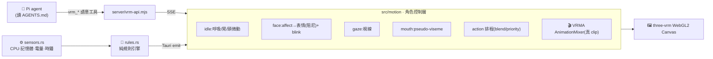

<div align="center">

# 🎭 VRM · Pi · three-vrm

**一個會「自己活著」的 3D VRM 虛擬角色**

AI agent 以語意工具操控 · 偵測系統狀態自動演出的桌面寵物 · 連續靈動 + VRMA 表演層



<sub>角色「持續活著」:呼吸、眨眼、視線、情緒殘留、嘴型、可混合的動作都連續演出。<br/>圖為 agent 驅動 Celeste 開心揮手說話 —— 全程真實 WebGL 渲染,非 mock。</sub>

</div>

---

## ✨ 這是什麼

一個**真的** [three-vrm](https://github.com/pixiv/three-vrm) 瀏覽器 runtime(不是示意、不是 mock),從三個面向把 VRM 變成「有生命感、可被 AI 穩定操控」的角色:

1. 🤖 **Agent 模式** — Pi agent 讀 `pi/AGENTS.md` 的角色設定,自己決定並呼叫高階**語意工具**(`vrm_say`/`vrm_expression`/`vrm_motion`/`vrm_action`/`vrm_mood`/`vrm_reset`),經本地 API + SSE 讓角色即時表演。
2. 🖥️ **獨立桌面模式** — [Tauri](https://tauri.app) 打包的 macOS 桌面 app,**Rust 後端偵測系統狀態**(CPU/記憶體/電量/時鐘),用**純規則引擎**自動演出。零模型、零網路。
3. 🌱 **連續角色控制層 + VRMA 表演層** — 事件不直接動骨頭,中間一層把離散語意變成**連續、可疊加、會過渡**的動作:程序化靈動(呼吸/眨眼/視線/情緒/嘴型)+ 真 **VRMA** clip(招牌大動作)。

> 核心思想:**AI 只輸出表演意圖,不碰骨頭。** 由控制層決定選哪個動畫、怎麼混合、怎麼收尾。

---

## 🌟 特色

- 🌱 **連續靈動**:呼吸、身體微晃、頭部微動、自然眨眼、視線追隨、情緒殘留(affect)、漸變不硬切的表情、pseudo-viseme 嘴型、可混合(blend)的動作排程
- 🎬 **VRMA 表演 clip 層**:真 `.vrma`(`AnimationMixer`)當招牌動作 + procedural 補日常靈動,統一在一份 manifest(`source: vrma | procedural`)
- 🎨 **真實 WebGL2 渲染**(three.js + `@pixiv/three-vrm`)—— 有像素級驗證
- 🧠 **系統感知自動演出**:高 CPU → 驚訝、低電量 → 難過、插電 → 開心揮手、整點 → 報時、閒置 → 放鬆
- 🔀 **執行時換 VRM**:下拉選單 / HTTP API / 網址參數 / Tauri 指令;支援 **VRM 0.x 與 1.0**
- 🗣️ **AI agent 語意操控**(本地 Qwen 或 OpenRouter 皆可),只暴露 6 個語意工具,**不開放 shell / 原始骨骼**
- 🖥️ **一鍵打包**成 macOS `.app` 桌面寵物
- ✅ **全程可驗證**:6 支 Playwright proof(渲染/agent/換VRM/靈動/VRMA)+ Rust 單元測試 + 真實 agent round

---

## 📸 Demo

| 🌱 連續靈動(Celeste) | 🎬 VRMA 表演層 |
|:---:|:---:|
|  |  |
| 呼吸/眨眼/視線/情緒殘留 + 混合動作 + viseme 嘴型 | wave 觸發真 MIT `.vrma`(手臂),procedural 維持呼吸/正面 |

| 🤖 Agent 驅動 | 🔀 執行時更換 VRM |
|:---:|:---:|
|  |  |
| Pi 讀 `AGENTS.md` → 呼叫工具讓角色微笑+揮手+說話 | `user-avatar`(VRM 1.0)↔ `sendagaya-shino`(VRM 0.x) |

---

## 🏗️ 架構

一個前端、兩種傳輸來源,中間是統一的**角色控制層** —— 所以瀏覽器測試與桌面 app 跑的是同一份程式。



開機自動判斷傳輸:在 Tauri 視窗內 → Tauri IPC;一般瀏覽器 → SSE。

---

## 🚀 快速開始

```bash
cd vrm-pi-three-vrm-goal-target
npm install
```

### 🖥️ 獨立桌面寵物(系統感知、自動演出)
```bash
npm run tauri:dev      # 開發執行(需 Rust toolchain:~/.cargo/bin 在 PATH)
npm run tauri:build    # 打包 .app / .dmg → src-tauri/target/release/bundle/macos/VRM Pet.app
```

### 🤖 Agent 模式(Pi / HTTP 驅動)
```bash
npm run api            # VRM API + SSE 事件橋(:8970)
npm run dev            # 瀏覽器 runtime(Vite)
```

---

## 📂 專案結構

```
vrm-pi-three-vrm-goal-target/
├── index.html                  # 入口頁(canvas + HUD + 機器可讀狀態)
├── src/main.ts                 # 纖薄入口:渲染、loadVrm 換角色、雙傳輸、下拉選單(動作全交給控制層)
├── src/motion/                 # 連續動作控制層 + VRMA 表演層
│   ├── MotionController.ts      #   idle/呼吸/眨眼/視線/affect 表情/viseme/動作排程 + VRMA AnimationMixer
│   ├── actions.ts              #   程序化動作 preset(wave/nod/thinking/surprised/sad/sleepy…)
│   └── clips.ts                #   ClipRegistry + intent selector(vrma|procedural manifest)
├── server/vrm-api.mjs          # Express:POST /vrm/{say,expression,motion,action,mood,reset,load}、GET /vrm/{events,avatars,health}
├── pi/
│   ├── AGENTS.md               # 「Aria」角色設定 + 一定要用工具的規則
│   └── vrm-tools.ts            # Pi 擴充:6 個語意工具 → POST 到 API
├── src-tauri/                  # 獨立桌面 app(Rust + Tauri 2)
│   └── src/{main,sensors,rules}.rs   # tick 迴圈 / 系統感測 / 純規則引擎(可單元測試)
├── public/avatars/             # 可切換的 VRM(user-avatar=Celeste 預設、default、sendagaya-shino)
├── public/vrma/                # VRMA clip:clips.json manifest + gesture_wave_01.vrma(MIT)
├── proof-{a..f}.mjs            # 6 支驗證腳本
├── docs/                       # 設計 spec + 圖片
└── CLAUDE.md                   # 開發指南(給 Claude / 工程師)
```

---

## 🌱 角色靈動度(連續動作控制層)

`src/motion/MotionController` 把離散事件變成連續、分層、會混合的動作,讓角色「持續活著」:

| 分層 | 內容 |
|---|---|
| **idle(永遠在動)** | 呼吸(脊椎/胸口正弦)、身體微晃、頭部微動 |
| **face** | affect 模型(valence/arousal,會殘留並衰減)+ 明確表情 → 目標值**每幀阻尼漸變**(不硬切、可疊加) |
| **blink** | 自然 1.4–4.8 秒間隔(偶爾連眨),快速阻尼開合 |
| **gaze** | 閒置隨機看四周 / 說話時看鏡頭 / 瀏覽器內微追滑鼠 |
| **mouth** | `say(text)` 產生 pseudo-viseme 序列(aa/ih/ee/oh/ou + 標點閉嘴),平滑過渡 |
| **action 排程** | 具名動作 blend in/out、強度、優先序;同名 cross-fade,不同動作可疊加 |

`proof-e.mjs` 量測:idle 微動、眨眼計數、表情漸變(非瞬切)、動作 blend-in、嘴型 viseme 變化。

---

## 🎬 VRMA 表演 clip 層

`public/vrma/clips.json` 用 `source: vrma | procedural` 統一管理所有 clip;agent 只送語意(`wave`/`nod`/`think`),**selector**(`clips.ts`)依 category/emotion/intensity + cooldown/anti-repeat 選 clip。

- 真 `.vrma`(pixiv **MIT** `gesture_wave_01.vrma`,當**驗證錨點**)經 `@pixiv/three-vrm-animation` + `THREE.AnimationMixer` 播放;播放時 procedural 微動作仍**疊加**進行(角色不凍住),並把軀幹維持正面,讓通用 clip 的手臂動作讀起來像乾淨揮手。
- 設計取向:**真 VRMA = 招牌動作 / 少量高品質;procedural = 日常靈動。** 升級只需丟入更精緻的 wave `.vrma` + 一筆 manifest,**免改程式**。
- Runtime state(供測試):`realVrmaLoaded` / `realVrmaPlayed` / `proceduralActive` / `lastClipSource`。

`proof-f.mjs` 驗證:真 `.vrma` 載入+播放、`lastClipSource=vrma`、≥3 個 procedural、事件前已 idle、agent 的 wave 觸發真 VRMA。

---

## 🎛️ 規則引擎(獨立模式自動演出)

定義在 `src-tauri/src/rules.rs`,只在**狀態改變 / 邊緣觸發**時發動,有冷卻,所以不會狂刷:

| 條件 | 角色反應 |
|---|---|
| CPU > 85% | 😠 生氣 +「Phew, I'm flat out here!」|
| CPU > 70% | 😲 驚訝 |
| 記憶體 > 85% | 😢 難過 |
| 電量 < 20% 且未充電 | 😢 難過 +「My battery's getting low…」|
| 開始充電(邊緣) | 😄 開心 + 👋 揮手 +「Ah, power!」|
| 每到整點(一次) | 👋 揮手 +「It's N o'clock!」|
| 閒置(CPU < 25%) | 😌 放鬆 + 偶爾點頭 |

---

## 🔀 更換 VRM

把任意 `.vrm` 丟進 `public/avatars/`,自動出現在下拉選單。執行時四種切換方式:

| 方式 | 用法 |
|---|---|
| 下拉選單 | 視窗右上角的 `<select>` |
| 網址參數 | `?vrm=sendagaya-shino.vrm` |
| HTTP API | `POST /vrm/load {"name":"sendagaya-shino.vrm"}` |
| Tauri 指令 | `load_avatar(name)` |

> 🧭 VRM 1.0 朝 +Z(面向鏡頭);VRM 0.x 朝 −Z,`main.ts` 會把 VRM0 旋轉 180°。**取景**對準頭部骨骼(跨模型穩定)。預設角色為 `user-avatar.vrm`(Celeste)。

---

## 🗣️ Pi agent 語意工具

`pi/AGENTS.md` 把角色設定成 **Aria**,並要求「用工具、不要用文字描述動作」。`pi/vrm-tools.ts` 只暴露這 6 個語意工具(不開放 shell / 原始骨骼 / 任意 HTTP):

| 工具 | 功能 | 參數 |
|---|---|---|
| `vrm_expression` | 設定表情(漸變、可殘留) | `emotion`: happy/angry/sad/relaxed/surprised/neutral |
| `vrm_motion` | 播放動作 | `motion`: wave / nod |
| `vrm_say` | 說一句話(自動產生嘴型) | `text` |
| `vrm_reset` | 回到中性 | （無）|
| `vrm_action` | 播放可混合的具名動作 | `name`: wave/happy_wave/nod/thinking/surprised_recoil/sad_slump/sleepy_relax;`intensity?`、`durationMs?` |
| `vrm_mood` | 設定情緒 affect(殘留並衰減) | `mood`: happy/curious/sad/angry/calm/relaxed/sleepy/surprised;`strength?`、`decayMs?` |

執行(本地 Qwen,文字模式):
```bash
cd pi
pi -e vrm-tools.ts --no-builtin-tools \
   -t vrm_say,vrm_expression,vrm_motion,vrm_reset,vrm_action,vrm_mood \
   --provider llama-server --model "HauhauCS/Qwen3.6-27B-Uncensored-HauhauCS-Balanced" \
   --thinking off -p "開心地跟我打招呼並揮手"
```

---

## ✅ 驗證(此專案是真的,不是 mock)

```bash
node proof-a.mjs                                   # 渲染:直接打 API → 真 GPU 瀏覽器 + 像素檢查 + 截圖
node proof-b.mjs                                   # 本地 Qwen agent → 工具 → event log(happy/wave/say)
bash proofs/setup-handless.sh && node proof-c.mjs  # handless-termal 驅動 agent → 瀏覽器 E2E
node proof-d.mjs                                   # 執行時換 VRM
node proof-e.mjs                                   # 角色靈動度:idle 微動/眨眼/表情漸變/動作 blend/viseme
node proof-f.mjs                                   # VRMA 層:真 .vrma 載入+播放、≥3 procedural、事件前已 idle、agent wave→vrma
( cd src-tauri && cargo test )                     # 規則引擎單元測試（5 項）
```

> 模型注意:**agent 用本地 Qwen 3.6 27B**(`llama-server`)在 pi **文字模式 + `--thinking off`** 下最穩。pi 的 **`--mode json`**(handless 強制)在本地模型上會超時,故 **handless round 改用 OpenRouter `deepseek/deepseek-v4-flash`**(透過 `bin/pi` 包裝);其餘全本地。`llama-server` 單 slot,被中斷的 json 請求會卡住下一個,讓它跑完即可。

---

## 📜 資產授權

| 檔案 | 來源 | 授權 | 版本 |
|---|---|---|---|
| `avatars/user-avatar.vrm`(Celeste,預設) | 使用者提供(Google Drive)| 內嵌 VRM 1.0 授權(JustAPal & SR)| VRM 1.0 |
| `avatars/default.vrm` | pixiv `three-vrm`(`VRM1_Constraint_Twist_Sample`)| **MIT** | VRM 1.0 |
| `avatars/sendagaya-shino.vrm` | `madjin/vrm-samples`（VRoid）| **CC0** | VRM 0.x |
| `vrma/gesture_wave_01.vrma` | pixiv `three-vrm-animation` 範例 | **MIT** | VRMA 1.0 |

詳見 `public/avatars/SOURCES.md`、`public/vrma/SOURCES.md`。範例皆可安全用於本地開發。

> ⚠️ `user-avatar.vrm`(Celeste)因內嵌授權對「再散布」不明確,**未納入此公開 repo**。app 在該檔缺席時會自動 fallback 到 `default.vrm`;要以 Celeste 為預設,請自行放入 `public/avatars/user-avatar.vrm`。

---

## 📄 文件

- 開發指南:[`CLAUDE.md`](CLAUDE.md)
- 設計 spec:[`docs/superpowers/specs/`](docs/superpowers/specs/)

<div align="center"><sub>three.js · @pixiv/three-vrm · @pixiv/three-vrm-animation · Tauri 2 · Express · Playwright · Pi</sub></div>
