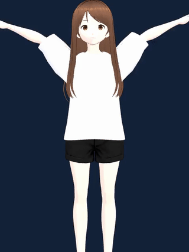
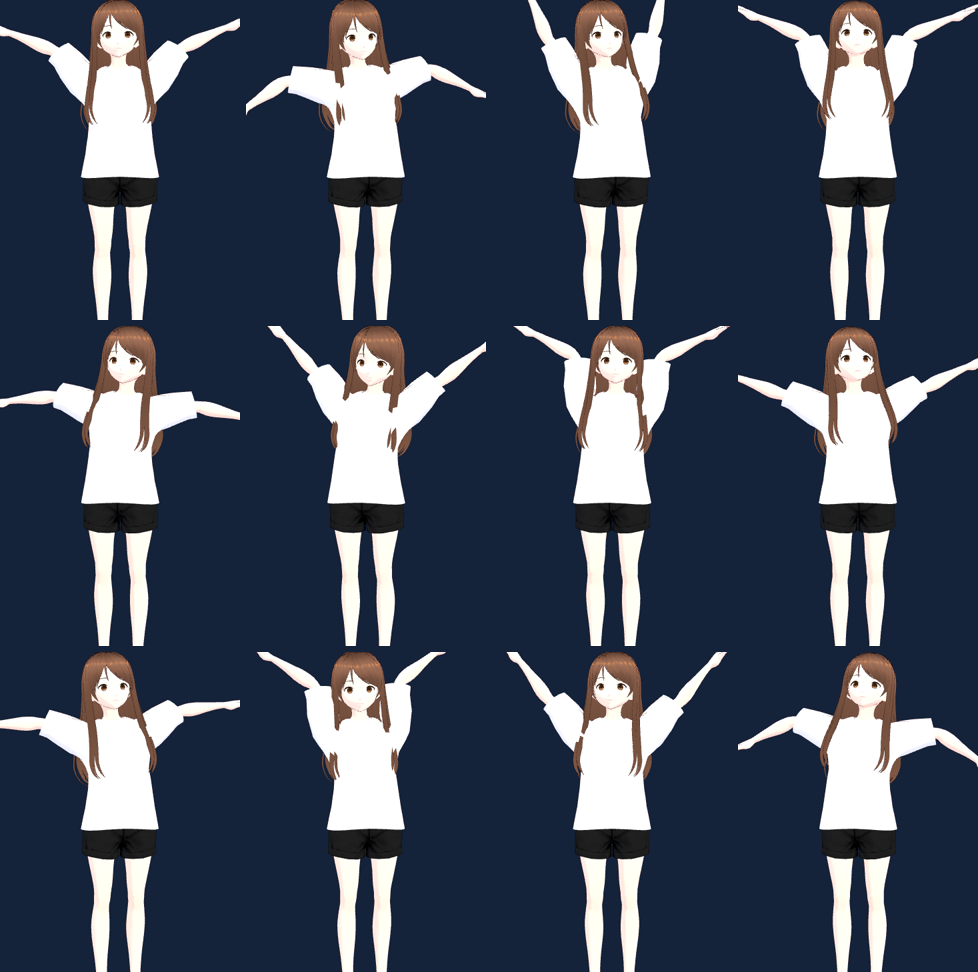

# 使用說明:影片 → VRMA → 預覽(Mac)

把一支**舞蹈影片**(YouTube URL 或本機檔)轉成 `.vrma`,並算繪成**套用在 VRM 角色上的預覽影片**(MP4 + GIF)。

> 設計與研究背景見 [`dance-video-to-vrma-plan.md`](./dance-video-to-vrma-plan.md)。

## 預覽長這樣(合成動作 + `default.vrm`,可入庫示範)



> 這支 GIF 由 `proof-h.mjs` 用**合成動作**(`tools/make-vrma.mjs` 產的 `generated_demo.vrma`)+ pixiv MIT 的 `default.vrm` 算出來,無版權疑慮。

---

## 1. Mac 前置安裝(一次)

需求:macOS(已在 Apple M4 Max 驗證,**無需 CUDA/GPU**)。

```bash
# 系統工具(影片下載 / 轉檔)
brew install yt-dlp ffmpeg

# 專案前端依賴 + 無頭瀏覽器(算繪預覽用)
cd /Users/tung/Codes/vrm-pi-three-vrm-goal-target
npm install
npx playwright install chromium      # 若尚未安裝

# Python + MediaPipe(姿態估計;建議用 venv 避免污染系統)
python3 -m venv .venv-mocap
.venv-mocap/bin/pip install mediapipe opencv-python "numpy<2"
```

> 姿態模型(`pose_landmarker_full.task`, 9MB)會在第一次執行時自動下載到 `~/.cache/vrma-mocap/`。

---

## 2. 快速開始

```bash
# 指定 YouTube 短片(產物只在本機,勿散佈——見授權)
node tools/video-to-vrma.mjs 'https://youtube.com/shorts/XXXXXX' --out-dir ./.vrma-out

# 或指定本機影片檔
node tools/video-to-vrma.mjs ~/Movies/mydance.mp4 --out-dir ./.vrma-out --name mydance

# 只要 .vrma 不要預覽
node tools/video-to-vrma.mjs <url|file> --no-preview
```

跑完會得到(在 `--out-dir`):`<name>.vrma`、`<name>.mp4`、`<name>.gif`、`<name>.pose.json`。

把 `<name>.vrma` 丟進 `public/vrma/` 並在 `public/vrma/clips.json` 加一筆,角色就會用它(見 plan 文件 §6)。

---

## 3. 三支工具 + 參數

### `tools/video-to-vrma.mjs`(端到端 orchestrator)
影片 → 抽幀 → 姿態 → retarget → `.vrma` →(預覽)。

| 參數 | 預設 | 說明 |
|---|---|---|
| `<url\|file>`(位置參數) | — | YouTube URL **或** 本機影片檔 |
| `--out-dir DIR` | `./.vrma-out` | 產物目錄 |
| `--name NAME` | `dance` | 產物檔名前綴 |
| `--start FRAME` | `0` | `.vrma` 取樣起始幀(在 pose 序列中) |
| `--len FRAMES` | 全部 | `.vrma` 幀數 |
| `--fps N` | `30` | 抽幀 fps |
| `--vrm <path\|/url>` | `/avatars/default.vrm` | 預覽角色 |
| `--no-preview` | — | 只產 `.vrma`,跳過算繪 |
| `--python PATH` | 自動偵測 | 含 mediapipe 的 python(否則找 `VRMA_PYTHON`、`.venv-mocap`、`python3`) |
| `--keep-frames` | — | 保留抽出的幀 |

### `tools/render-vrma-preview.mjs`(單獨用:`.vrma` + VRM → MP4/GIF)
| 參數 | 預設 | 說明 |
|---|---|---|
| `--vrma <path\|/url>` | **必填** | 要預覽的 `.vrma`(本機檔或 `public/` 下 URL) |
| `--vrm <path\|/url>` | `/avatars/default.vrm` | 角色 |
| `--out FILE.mp4` | `preview.mp4` | 輸出 MP4(同名 `.gif`) |
| `--fps N` | `24` | 擷取 / MP4 幀率 |
| `--seconds N` | 全長 | 上限秒數 |
| `--width / --height` | `640 / 800` | 解析度 |
| `--gif-width N` / `--gif-fps N` | `360` / `min(15,fps)` | GIF 尺寸/幀率 |
| `--no-gif` / `--keep-frames` | — | 不產 GIF / 保留幀 |

輸出後印出 JSON 摘要(`frames`、`animated`、檔案大小);`animated=true` 且 MP4 非空才回傳 exit 0。

### `tools/extract_pose.py`(MediaPipe 姿態)
```bash
.venv-mocap/bin/python tools/extract_pose.py <frames_dir> <out.json> [--start N] [--end N] [--model PATH]
```

---

## 4. 測試

```bash
node proof-h.mjs        # 算繪預覽:用合成動作 + default.vrm → docs/images/preview-demo.{mp4,gif};驗證非空 + 會動(全綠)
node proof-g.mjs        # (既有)程式化 .vrma 被 runtime 載入 + 播放
```

---

## 5. AI 最佳化迴圈(observe & tune)— 專案技能 `dance-to-vrma`

把生成的動作「看著調到好」。CLI 會輸出一張 **contact sheet**(整段動作均勻取樣→單張 PNG),
AI 用 `Read` 看這張靜圖判讀整段動作品質(GIF 對 Read 只看得到第一幀),再依結果調 flags
重跑,反覆到最佳。完整可載入流程見技能 `.claude/skills/dance-to-vrma/SKILL.md`。

迴圈:`跑 video-to-vrma → Read <name>.contact.png → 對照下表診斷 → 調 flags 重跑(同 --out-dir 重用已下載影片)→ 重複 → 好了給使用者 .gif/.mp4`。

範例 contact sheet(合成動作示範,12 格 = 整段動作):



### 引擎(`--engine`)

預設 **`kalidokit`**(品質較好:正確運動學 + 手臂 twist + 手腕 + 腿 + **手指**)。常用 kalidokit flags:
`--face-flip`(修「背對鏡頭」——第三人稱影片常需,因 Kalidokit 假設自拍面向)、`--mirror`(左右反)、
`--flat-hips`(身體轉太兇)、`--smooth A`(抖→調高 0.5–0.7)、`--no-legs`、`--no-fingers`。
手指在全身 contact sheet 太小,用 `--zoom 0.6 --aim 0.85` 另算一張近拍檢查。
舊的 naive 引擎用 `--engine simple`(無 twist,下表 flags)。完整診斷見技能 `.claude/skills/dance-to-vrma/SKILL.md`。

### simple 引擎 retarget flags

| flag | 效果 | 何時用 |
|---|---|---|
| `--legs` | 連腿一起 retarget | 腿僵直不動 |
| `--hips` | 套用 hips 轉身 | 身體都不轉、太死板正面 |
| `--mirror` | 左右對調 | 動作左右相反 |
| `--flip-x` / `--flip-y` / `--flip-z` | 翻座標軸 | 整個人面向錯/上下顛倒 |
| `--smooth A` | 方向 EMA(預設 0.4) | 抖→調高 0.6;糊→調低 0.25 |
| `--damp-head F` | 頭部強度(預設 0.4) | 頭甩太兇→調低 |
| `--damp-spine F` | 軀幹強度(預設 0.7) | 身體前傾過頭→調低 |
| `--start` / `--len` | 取樣區間 | 跳過遮擋/挑最好段落 |
| `--contact-sheet` | 輸出 contact sheet PNG | `video-to-vrma` 預設開;`--no-contact-sheet` 關 |

### 診斷 → 對策

| 在 contact sheet 看到 | 對策 |
|---|---|
| 腿整段僵直 | `--legs` |
| 身體永遠正面、很死板 | `--hips` |
| 動作跟影片左右相反 | `--mirror` |
| 角色背對 / 面向錯 | `--flip-z`(不對再試 `--flip-x`) |
| 上下顛倒 / 陷進地板 | `--flip-y` |
| 逐幀抖動 | `--smooth 0.6` |
| 動作糊掉 / 失拍 | `--smooth 0.25` |
| 頭亂甩 | `--damp-head 0.2` |
| 軀幹彎太多 | `--damp-spine 0.4` |
| 某肢亂飛 | 該段遮擋,換 `--start/--len` |

---

## 6. 授權(重要)

- 用**他人影片**(如 YouTube 短片)產出的 `source.*`、`pose.json`、`.vrma`、預覽 **只供本機技術用途,勿散佈/商用**——影片著作權、編舞著作權、被攝者權利都可能涉及。本工具對 URL 輸入會印出 `LOCAL ONLY` 警告,且 `./.vrma-out/` 與 `__preview_tmp_*` 已列入 `.gitignore`。
- **可入庫/可商用**的素材請用:自製合成動作、自行拍攝、或 CC0/授權影片。`docs/images/preview-demo.*` 即為此類(合成 + MIT VRM)。

---

## 7. 疑難排解

| 症狀 | 解法 |
|---|---|
| `No Python with mediapipe found` | 照 §1 建 `.venv-mocap` 或 `--python <path>` / 設 `VRMA_PYTHON` |
| `no WebGL2-capable browser` | `npx playwright install chromium`;無頭時自動退回 swiftshader |
| `yt-dlp` 下載失敗 | 更新 `brew upgrade yt-dlp`;或先自行下載再用本機檔路徑 |
| 預覽動作怪/鏡像 | 簡化 retarget 的已知限制(見 plan §8);調 `--start/--len` 換段落,或改用 Kalidokit/WHAM 前端 |
| GIF 太大 | 調小 `--gif-width` / `--gif-fps`,或 `--no-gif` 只留 MP4 |
